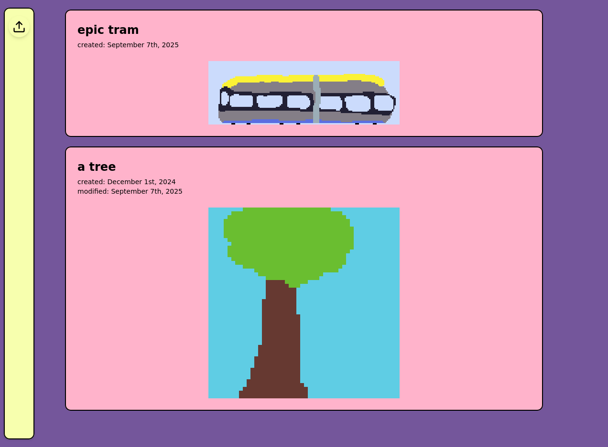

# Malbuch

<!--  -->

Aka coloring book.

A simple gallery/timeline to collect images.
This is meant to be a place where you can collect (among other things) pixel art you created.

Currently only file upload and deletion is supported.

## usage

**deployment**

- clone repo
- build project with `./build.sh`
- run with `docker compose up -d`
- visit http://localhost:8080

**development**

([Nix](https://nixos.org/learn/) + [Direnv](https://wiki.nixos.org/wiki/Direnv) is recommended, this setup will provide needed dependencies automatically)

- `cd fe` and `pnpm install --frozen-lockfile`
- run with `pnpm run dev`

in a separate shell:

- `cd be` and `cargo run`

## thoughts

- It is supposed to be easily usable and nice to look at.
- I do not recommend exposing this to the web as the API allows users to fill up your disk in no time.
- This is my first project with an API and Docker images, so if you have any suggestions on best-practices, feel free to open an Issue or a PR.
- Let's hope this will help me pursue learning pixel art.

## some Components used

general:

- color palette: [blessing](https://lospec.com/palette-list/blessing)
- frontend: [vite](https://vite.dev/), [shadcn](https://ui.shadcn.com/)
- backend: [warp](https://docs.rs/warp/latest/warp/)

specifics:

- icons: https://icons.pqoqubbw.dev/?q=upl
- form-validation: [Zod](https://zod.dev/api)
- dates: [date-fns](https://date-fns.org/v4.1.0/docs/)
- toast messages: [sonner](https://sonner.emilkowal.ski/)
